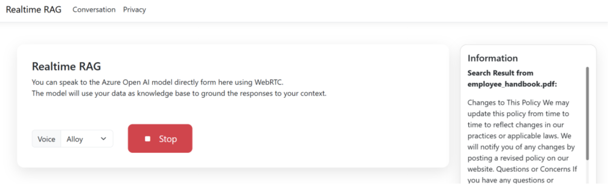

# Building a Real-time Audio RAG System with Azure OpenAI and WebRTC

[](https://github.com/codespaces/new?hide_repo_select=true&ref=main&skip_quickstart=true&machine=basicLinux32gb&repo=860141324&devcontainer_path=.devcontainer%2Fdevcontainer.json&geo=WestUs2)
[](https://vscode.dev/redirect?url=vscode://ms-vscode-remote.remote-containers/cloneInVolume?url=https://github.com/MoimHossain/aoi-real-time-audio-rag)

This repo contains an example of how to implement RAG support in applications that use voice as their user interface, powered by the GPT-4o realtime API for audio. This demo uses WebRTC for real-time audio streaming and retrieval-augmented generation (RAG) to enhance the AI's responses.


## Screenshot



## Features

> This proof of concept demonstrates the WebRTC based realtime RAG. For Web Socket based implementation can be found here - [https://github.com/Azure-Samples/aisearch-openai-rag-audio](https://github.com/Azure-Samples/aisearch-openai-rag-audio). 

* **Voice interface**: The app uses the browser's microphone to capture voice input, and sends it to the backend where it is processed by the Azure OpenAI GPT-4o Realtime API.
* **RAG (Retrieval Augmented Generation)**: The app uses the Azure AI Search service to answer questions about a knowledge base, and sends the retrieved documents to the GPT-4o Realtime API to generate a response.
* **Audio output**: The app plays the response from the GPT-4o Realtime API as audio, using the browser's audio capabilities.
* **Citations**: The app shows the search results that were used to generate the response.
## Architecture Overview

The system consists of three main components:
1. A web-based client interface using WebRTC for audio streaming
2. A .NET backend that handles the Azure OpenAI integration
3. An Azure AI Search index that stores and retrieves enterprise data

> This repository assumes you have Azure Open AI with gpt-4o-mini-realtime-preview (version:2024-12-17) model deployed, and Azure AI search Index exists where Documents are vectorized already. If you want to explore how these can be accomplished please follow the instructions in this Azure Sample: [https://github.com/Azure-Samples/aisearch-openai-rag-audio](https://github.com/Azure-Samples/aisearch-openai-rag-audio). 

## Client-Side Implementation

The client-side implementation uses WebRTC to establish a peer-to-peer connection for audio streaming. Here's how the key components work:

### Setting up WebRTC Connection

First, we establish a WebRTC peer connection and set up the audio stream:

```javascript
async function createRTCPeerConnection() {
    window.peerConnection = new RTCPeerConnection();
    // Set up audio playback
    window.audioElement = document.createElement('audio');
    window.audioElement.autoplay = true;
    document.body.appendChild(window.audioElement);
    window.peerConnection.ontrack = (event) => { 
        window.audioElement.srcObject = event.streams[0]; 
    };
    // Get user's audio input
    const clientMedia = await navigator.mediaDevices.getUserMedia({ audio: true });
    const audioTrack = clientMedia.getAudioTracks()[0];
    window.peerConnection.addTrack(audioTrack);
}
```

### Data Channel for RAG Integration

We create a data channel to handle the RAG functionality:

```javascript
async function createDataChannel() {
    window.dataChannel = window.peerConnection.createDataChannel('realtime-channel');
    
    window.dataChannel.addEventListener('message', (event) => {
        const realtimeEvent = JSON.parse(event.data);        
        const handler = OAI_RTC_EVENT_HANDLERS[realtimeEvent.type];
        if (handler) { handler(realtimeEvent); }
    });
}
```

### Handling AI Instructions and Search

The system is configured to use enterprise data through a search tool:

```javascript
const event = {
    type: "session.update",
    session: {
        instructions: "You are a helpful AI assistant for Enterprise, English is your default language. You must search the data from Enterprise using 'search' tool and response based on search result.",
        tools: [{
            type: "function",
            name: "search",
            description: "Search enterprise information",
            parameters: {
                type: "object",
                properties: {
                    searchKey: {
                        type: "string",
                        description: "Search Key or phrase"
                    }
                },
                required: ["searchKey"]
            }
        }],
        tool_choice: "auto"
    }
};
```

## Backend Implementation

The .NET backend handles the embedding generation and search functionality. Here's a look at the embedding service:

```csharp
public async Task<ReadOnlyMemory<float>> GenerateEmbeddingAsync(
    string text, CancellationToken cancellationToken)
{
    var embeddingClient = openAIClient.GetEmbeddingClient(openAIConfig.EmbeddingDeploymentId);
    var embeddings = await embeddingClient.GenerateEmbeddingAsync(text, options, cancellationToken);
    return embeddings.Value.ToFloats();
}
```

The backend processes the audio stream, converts it to text, searches the enterprise data using Azure AI Search, and returns relevant responses through the WebRTC connection.

### Search Service Implementation

The search service implements vector search using Azure AI Search. Here's how it performs the search:

```csharp
public class SearchService(SearchClient searchClient, ILogger<SearchService> logger)
{
    public async Task<ContentRecord[]> SearchAsync(
        IndexConfig indexConfig, ReadOnlyMemory<float> queryEmbedding, 
        CancellationToken cancellationToken)
    {
        return await QueryDocumentsAsync(
            indexConfig,
            query: null,
            embedding: queryEmbedding,
            overrides: new RequestOverrides
            {
                Top = 3,
                SemanticRanker = false,
                SemanticCaptions = false,
                RetrievalMode = RetrievalMode.Text
            },
            cancellationToken: cancellationToken);
    }
}
```

The search functionality uses vector similarity to find relevant documents:

```csharp
if (embedding != null)
{
    var vectorQuery = new VectorizedQuery(embedding.Value)
    {
        KNearestNeighborsCount = useSemanticRanker ? 50 : top,
    };
    vectorQuery.Fields.Add(indexConfig.VectorFieldName);
    searchOptions.VectorSearch = new();
    searchOptions.VectorSearch.Queries.Add(vectorQuery);
}

var searchResultResponse = await searchClient.SearchAsync<SearchDocument>(
    query, searchOptions, cancellationToken);
```

This implementation enables efficient semantic search through the enterprise data using vector embeddings, allowing the system to find contextually relevant information based on the user's voice input.

## User Interface

The interface provides a simple yet effective way to interact with the system:

```html
<div class="row align-items-center g-3">
    <div class="col-auto">
        <div class="input-group">
            <label class="input-group-text" for="voiceSelect">Voice</label>
            <select id="voiceSelector" class="form-select">
                <option value="alloy">Alloy</option>
                <!-- Additional voice options -->
            </select>
        </div>
    </div>
    <div class="col-auto">
        <button id="btnBeginSession" type="button" class="btn btn-primary">
            <i class="bi bi-mic-fill"></i>
            Start
        </button>
    </div>
</div>
```

## Benefits of Using WebRTC

1. **Lower Latency**: WebRTC provides peer-to-peer communication, reducing the latency compared to WebSocket implementations.
2. **Higher Throughput**: The direct connection allows for better audio quality and faster response times.
3. **Built-in Audio Handling**: WebRTC includes native audio processing capabilities, making it ideal for voice applications.

## Conclusion

This proof of concept demonstrates how to create a real-time audio RAG system using Azure OpenAI and WebRTC. The implementation provides a seamless way to interact with enterprise data through natural conversation while maintaining low latency and high quality audio communication.

The combination of WebRTC's real-time capabilities with Azure OpenAI's language models and Azure AI Search's enterprise search capabilities creates a powerful system for enterprise knowledge access and retrieval.

